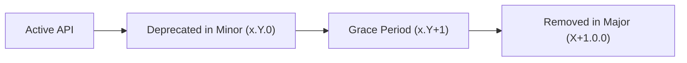

# Semantic Versioning & Breaking Change Policy

This document defines the Semantic Versioning (SemVer) policy for **`stellar-hooks`**. It sets explicit expectations for consumers and contributors regarding API stability, what constitutes a breaking change, and the deprecation lifecycle.

---

## 1. Versioning Scheme

`stellar-hooks` strictly adheres to [Semantic Versioning 2.0.0](https://semver.org/):

$$\text{MAJOR}.\text{MINOR}.\text{PATCH}$$

- **MAJOR (`X.0.0`)**: Incompatible API changes, removal of deprecated features, or breaking changes in runtime requirements.
- **MINOR (`x.Y.0`)**: Backwards-compatible new features, new hooks, optional parameters, non-breaking performance improvements, and deprecation notices.
- **PATCH (`x.y.Z`)**: Backwards-compatible bug fixes, security patches, type corrections, and documentation updates.

> [!NOTE]
> During pre-1.0 development (`0.y.z`), breaking changes are reserved for minor bumps (`0.(y+1).0`), accompanied by migration notes in [`MIGRATION.md`](MIGRATION.md) and automated codemods whenever practical. Minor versions should never introduce breaking changes without prior deprecation where feasible.

---

## 2. What Counts as a Breaking Change?

Any change that requires consumers to modify their existing, valid application code or configuration to upgrade without compile errors, type errors, or unexpected runtime regressions is considered a **breaking change** and requires a **MAJOR** version bump.

### A. Hook Signatures & Arguments
- **Adding required arguments or options**: Adding a new mandatory parameter to a hook function or making an optional property in an options interface required.
- **Removing parameters**: Removing any parameter or option that was previously accepted.
- **Reordering parameters**: Changing the positional order of function or hook arguments.
- **Narrowing parameter types**: Restricting an accepted parameter type (e.g., changing `string | number` to `number`, or removing a supported union variant).

### B. Hook Return Shapes
- **Removing properties**: Removing any property, method, or callback from a hook's return object.
- **Renaming properties**: Renaming return keys (e.g., renaming `merge` to `submit`, `data` to `result`).
- **Narrowing or altering return types**: Changing return types in an incompatible way (e.g., changing `error: Error | null` to `error: StellarTransactionError | null` where consumers checked `error instanceof Error`).
- **Sync vs. Async conversions**: Changing a synchronous return value to a Promise, or altering callback signatures (e.g., `onSuccess`).

### C. Default Behavior & Side Effects
- **Changing default values**: Changing default option values that affect execution outcome (e.g., default transaction fees, timeouts, polling intervals, or network selection defaults).
- **Altering lifecycle side effects**: Changing when a hook performs an action (e.g., switching from automatic execution on mount to requiring an explicit `submit()` call).
- **Error handling semantics**: Changing whether a hook throws errors vs. captures them into an `error` state object.
- **Caching & invalidation defaults**: Significantly altering default cache lifetimes or query key deduplication in ways that alter data freshness expectations.

### D. Peer Dependencies & Runtime Environment
- **Bumping minimum peer dependencies**: Raising minimum supported versions of `react` or `react-dom` (e.g., dropping React 18 support).
- **Bumping minimum `@stellar/stellar-sdk`**: Raising the minimum required major version of `@stellar/stellar-sdk` (see [COMPATIBILITY.md](COMPATIBILITY.md)).
- **Raising Node.js runtime target**: Raising the minimum Node.js engine requirement beyond the active LTS baseline (e.g., dropping Node 18).

### E. Package Exports & Module Resolution
- **Removing named exports**: Removing any public function, hook, constant, or TypeScript interface/type from entry points.
- **Modifying subpath exports**: Removing or altering paths defined under `"exports"` in `package.json`.
- **Dropping module targets**: Removing either ESM (`.mjs`) or CommonJS (`.js`) distributions.

---

## 3. What is NOT a Breaking Change?

The following changes are backwards-compatible and belong in **MINOR** or **PATCH** releases:

- **Adding new hooks, functions, or utilities**: Completely additive features.
- **Adding optional parameters**: Adding new optional arguments or optional properties in options objects with non-breaking defaults.
- **Adding new properties to return objects**: Adding supplementary properties, helpers, or metadata to return values without removing or renaming existing ones.
- **Widening accepted parameter types**: Permitting additional types (e.g., accepting `bigint | string` where only `string` was accepted).
- **Bug fixes restoring documented behavior**: Correcting behavior that clearly deviated from the documented specification or failed with an unhandled exception.
- **Internal performance improvements**: Memory leak fixes, bundle size optimizations, refactoring internal reducers, or replacing internal utilities.
- **Deprecating features with warnings**: Adding a console warning via `warnDeprecated` and JSDoc `@deprecated` annotation while retaining existing functionality.

---

## 4. Deprecation Lifecycle & Transition Process

To provide a smooth developer experience, breaking changes must go through a structured transition period:

1. **Phase 1: Deprecation Notice (Minor Release `x.Y.0`)**
   - The feature is marked with `@deprecated` in TypeScript JSDoc comments detailing the replacement.
   - A runtime warning is logged once using `warnDeprecated()` providing actionable migration guidance.
   - The change is documented under `### Deprecated` in [`CHANGELOG.md`](CHANGELOG.md).
   - An entry is added to [`MIGRATION.md`](MIGRATION.md).

2. **Phase 2: Grace Period (Subsequent Minor Releases)**
   - The deprecated API remains fully operational and tested.
   - An automated `jscodeshift` codemod is provided in the repository to automate code upgrades.

3. **Phase 3: Removal (Next Major Release `(X+1).0.0`)**
   - The deprecated API is removed.
   - The removal is documented under `### Removed` and `**Breaking:**` in `CHANGELOG.md`.

---

## 5. Contributor Guidelines for PRs

When submitting a pull request:
1. Verify if your changes impact any existing public signatures or behaviors using the criteria above.
2. If introducing a breaking change, discuss it first in a GitHub issue.
3. If deprecating an API, use `warnDeprecated` from `src/utils/deprecation.ts` and add tests asserting the warning.
4. Update [`MIGRATION.md`](MIGRATION.md) and [`CHANGELOG.md`](CHANGELOG.md).
5. For complex migrations, provide a `jscodeshift` transform under `codemods/`.
